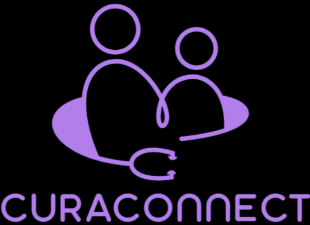

# CuraConnect – "Where Care meets Convenience"

Access to quality healthcare is often limited by distance and time. **CuraConnect** solves this by providing a seamless teleconsultation platform where patients can easily connect with trusted doctors from anywhere, pay securely online and share medical files in a few clicks. With integrated video calls, digital prescriptions and robust privacy protections, CuraConnect makes healthcare more accessible, efficient and patient-friendly. Its unique blend of convenience, security and comprehensive features sets it apart as a next-generation solution for modern healthcare needs.

##  Key Features

- **Online Appointment Booking:** Patients can easily schedule consultations with doctors from anywhere.
- **Email-Based OTP Verification:** Secure login and registration for both patients and doctors using one-time passwords sent to their email.
- **Secure Online Payments:** Integrated PayPal payments for hassle-free and safe transactions.
- **Google Meet Video Consultations:** Join secure video calls directly from the platform.
- **Medical File Uploads:** Patients and doctors can upload and share prescriptions, lab reports, and other medical documents.
- **Doctor & Patient Dashboards:** Personalized dashboards for managing appointments, files, and consultations.
- **Digital Prescriptions:** Doctors can upload and share prescriptions digitally with patients.
- **Anonymous Reviews:** Patients can leave feedback for doctors while maintaining their privacy.
- **Role-Based Access:** Separate, secure access and features for patients and doctors.
- **Responsive Design:** Fully functional on desktop, tablet, and mobile devices.
- **Strong Privacy Protections:** All sensitive data is encrypted and securely managed.
