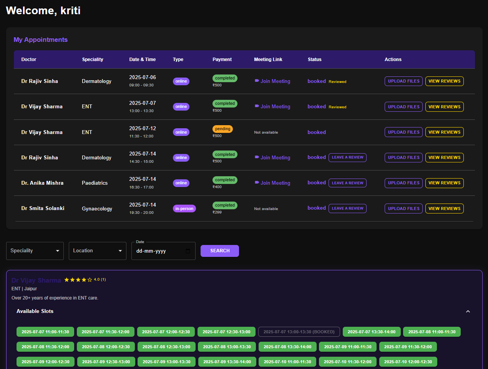

# CuraConnect – "Where Care meets Convenience"


Access to quality healthcare is often limited by distance and time. **CuraConnect** solves this by providing a seamless teleconsultation platform where patients can easily connect with trusted doctors from anywhere, pay securely online and share medical files in a few clicks. With integrated video calls, digital prescriptions and robust privacy protections, CuraConnect makes healthcare more accessible, efficient and patient-friendly. Its unique blend of convenience, security and comprehensive features sets it apart as a next-generation solution for modern healthcare needs.

##  Key Features


- **Online Appointment Booking:** Patients can easily schedule consultations with doctors from anywhere.
- **Search for Top Doctors:** Patients can search and discover top-rated doctors by speciality, location and date of availability.
- **Email-Based OTP Verification:** Secure login and registration for both patients and doctors using one-time passwords sent to their email.
- **Secure Online Payments:** Integrated PayPal payments for hassle-free and safe transactions.
- **Google Meet Video Consultations:** Join secure video calls directly from the platform.
- **Medical File Uploads:** Patients and doctors can upload and share prescriptions, lab reports and other medical documents.
- **Doctor & Patient Dashboards:** Personalized dashboards for managing appointments, files and consultations.
- **Digital Prescriptions:** Doctors can upload and share prescriptions digitally with patients.
- **Anonymous Reviews:** Patients can leave feedback for doctors while maintaining their privacy.
- **Role-Based Access:** Separate, secure access and features for patients and doctors.
- **Responsive Design:** Fully functional on desktop, tablet, and mobile devices.
- **Strong Privacy Protections:** All sensitive data is encrypted and securely managed.

## 📸 Screenshots

### Welcome Page


### Patient Testimonials


### FAQ Section


### Patient Dashboard


### Payment


### Doctor Login


### Doctor Dashboard


### File Upload


##  Architecture & Tech Stack

### Frontend
- **React.js** – Modern component-based UI library
- **Material-UI** – Responsive and accessible UI components
- **Axios** – For making HTTP requests to the backend

### Backend
- **Node.js** – JavaScript runtime for server-side logic
- **Express.js** – Fast, unopinionated web framework for Node.js
- **Multer** – Middleware for handling file uploads
- **JWT (jsonwebtoken)** – Secure authentication and authorization
- **Nodemailer** – For sending OTP and notification emails
- **PayPal REST SDK** – Integrated online payments

- **Google Calendar API** – Automatically schedules and manages online for google meet consultation appointments

### Database
- **MongoDB Atlas** – Cloud-hosted NoSQL database for storing users, appointments, files and reviews
- **Mongoose** – Elegant MongoDB object modeling for Node.js

### Other Tools
- **Git & GitHub** – Version control and collaboration
- **VS Code** – Recommended code editor
- **Postman** – API testing

---
##  Installation Guidelines

### Prerequisites
- [Node.js](https://nodejs.org/) (v16 or higher)
- [npm](https://www.npmjs.com/) (comes with Node.js)
- [MongoDB Atlas](https://www.mongodb.com/atlas) account (or local MongoDB)
- [PayPal Developer Account](https://developer.paypal.com/) for sandbox credentials
- [Google Cloud Account](https://console.cloud.google.com/) for Meet/Calendar API

---

### 1. **Clone the Repository**
```bash
git clone https://github.com/kritibhatnagar86/CuraConnect
cd CuraConnect
```

### 2. **Backend Setup**
```bash
cd backend
npm install
npm start
```

### 3. **Frontend Setup**
```bash
cd ../frontend
npm install
npm start
```

### 4. **Access the Application**
- Frontend: [http://localhost:3000](http://localhost:3000)
- Backend API: [http://localhost:5000](http://localhost:5000)

---

### 5. **Environment Variables**

- **Backend:**  
  Edit `backend/.env` with your:
  - MongoDB Atlas URI
  - JWT secret
  - Email credentials (for OTP)
  - PayPal sandbox credentials
  - Google API credentials


---

##  Contact

- **Developer Name**: Kriti Bhatnagar
- **Developer Contact Email**: [kritibhatnagar86@gmail.com](mailto:kritibhatnagar86@gmail.com)